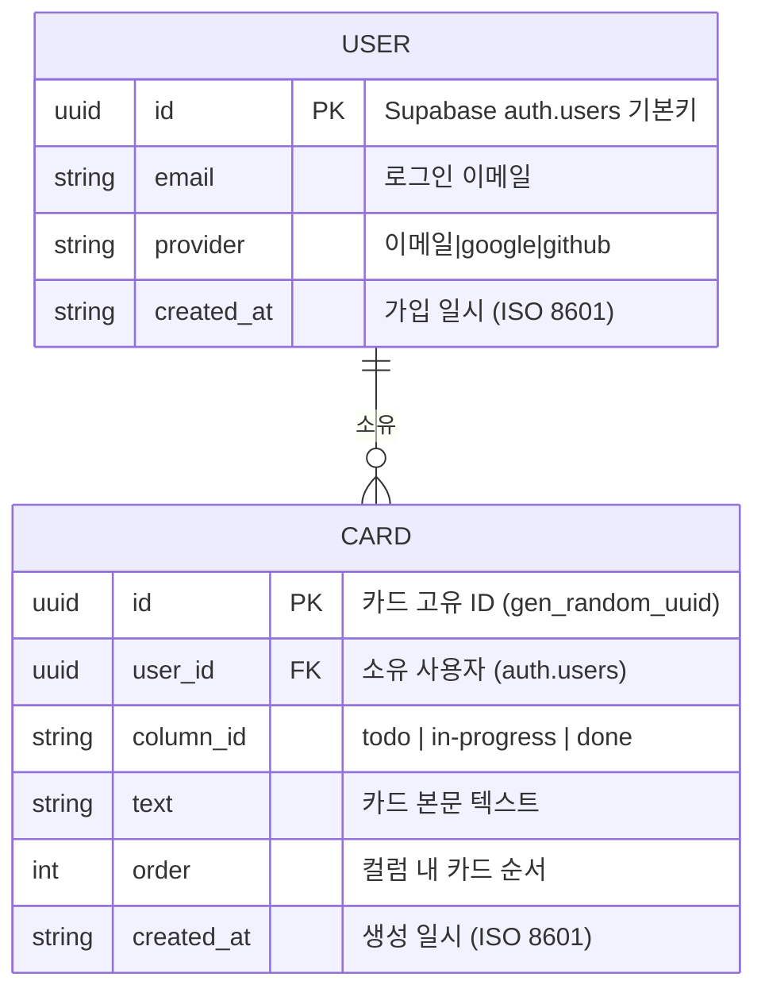
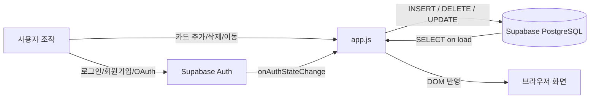

# Database Design — 데이터베이스 설계

> 이 앱은 Supabase PostgreSQL을 사용한다.  
> 카드 데이터는 **Supabase DB**에 저장되며, **RLS(Row Level Security)** 로 사용자별로 격리된다.

---

## 1. 논리 데이터 모델 (ERD)



> BOARD, COLUMN 엔티티는 앱 코드에서 상수(`COLUMN_IDS`)로 고정 관리되며 DB에 저장하지 않는다.

---

## 2. 엔티티 상세

### USER (Supabase auth.users — 내장 테이블)

| 필드 | 타입 | 설명 |
|------|------|------|
| `id` | UUID | 기본키 (Supabase 자동 생성) |
| `email` | string | 로그인 이메일 |
| `app_metadata.provider` | string | 인증 제공자 (`email`, `google`, `github`) |
| `created_at` | timestamptz | 가입 일시 |

`auth.users`는 Supabase가 관리하는 내장 테이블로, 직접 수정하지 않는다.

---

### CARD (public.cards — 직접 생성)

| 필드 | 타입 | 제약 | 설명 |
|------|------|------|------|
| `id` | UUID | PK, DEFAULT gen_random_uuid() | 카드 고유 ID |
| `user_id` | UUID | NOT NULL, FK → auth.users(id) | 소유 사용자 |
| `column_id` | TEXT | CHECK IN ('todo','in-progress','done') | 소속 컬럼 |
| `text` | TEXT | NOT NULL, char_length > 0 | 카드 내용 |
| `order` | INTEGER | NOT NULL, DEFAULT 0 | 컬럼 내 순서 |
| `created_at` | TIMESTAMPTZ | NOT NULL, DEFAULT now() | 생성 일시 |

---

## 3. Supabase PostgreSQL 스키마 (SQL)

Supabase 대시보드 → **SQL Editor**에서 아래 순서로 실행한다.

### 3.1 cards 테이블 생성

```sql
CREATE TABLE IF NOT EXISTS public.cards (
  id         UUID        PRIMARY KEY DEFAULT gen_random_uuid(),
  user_id    UUID        NOT NULL REFERENCES auth.users(id) ON DELETE CASCADE,
  column_id  TEXT        NOT NULL CHECK (column_id IN ('todo', 'in-progress', 'done')),
  text       TEXT        NOT NULL CHECK (char_length(text) > 0),
  "order"    INTEGER     NOT NULL DEFAULT 0,
  created_at TIMESTAMPTZ NOT NULL DEFAULT now()
);

-- 사용자별 + 컬럼별 조회 최적화 인덱스
CREATE INDEX IF NOT EXISTS idx_cards_user_column
  ON public.cards (user_id, column_id, "order");
```

### 3.2 RLS (Row Level Security) 설정

```sql
-- RLS 활성화
ALTER TABLE public.cards ENABLE ROW LEVEL SECURITY;

-- 본인 카드만 SELECT
CREATE POLICY "사용자 본인 카드 조회"
  ON public.cards FOR SELECT
  USING (auth.uid() = user_id);

-- 본인 카드만 INSERT (user_id를 auth.uid()로 강제)
CREATE POLICY "사용자 본인 카드 추가"
  ON public.cards FOR INSERT
  WITH CHECK (auth.uid() = user_id);

-- 본인 카드만 UPDATE
CREATE POLICY "사용자 본인 카드 수정"
  ON public.cards FOR UPDATE
  USING (auth.uid() = user_id)
  WITH CHECK (auth.uid() = user_id);

-- 본인 카드만 DELETE
CREATE POLICY "사용자 본인 카드 삭제"
  ON public.cards FOR DELETE
  USING (auth.uid() = user_id);
```

---

## 4. Supabase Authentication 설정

### 4.1 Providers (Authentication → Providers)

| 공급자 | 설정 방법 |
|--------|---------|
| Email | 기본 활성화. 개발 중 "Confirm email" OFF 권장 |
| Google | Google Cloud Console에서 OAuth 앱 생성 → Client ID / Secret 입력 |
| GitHub | GitHub OAuth App 생성 → Client ID / Secret 입력 |

Google/GitHub OAuth callback URL (공통):
```
https://YOUR_PROJECT_ID.supabase.co/auth/v1/callback
```

### 4.2 URL Configuration (Authentication → URL Configuration)

| 항목 | 값 |
|------|---|
| Site URL | `http://localhost:8765` (로컬) 또는 배포 URL |
| Redirect URLs | `http://localhost:8765`, `http://localhost:8765/index.html` |

---

## 5. 데이터 흐름


