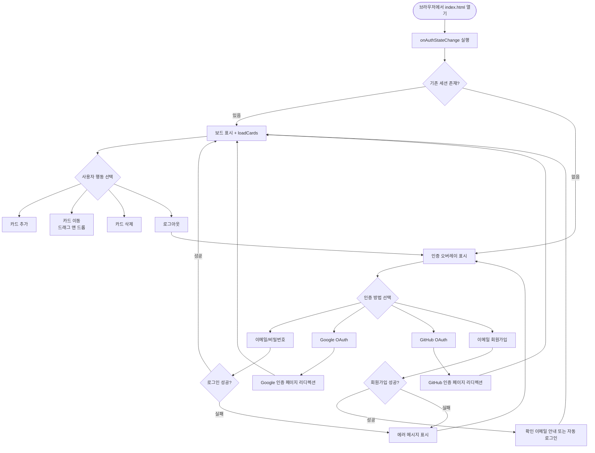
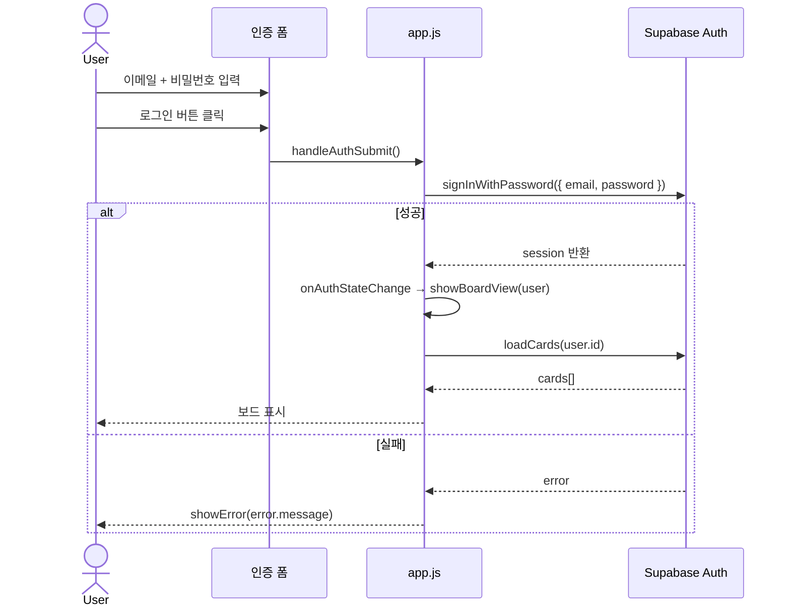
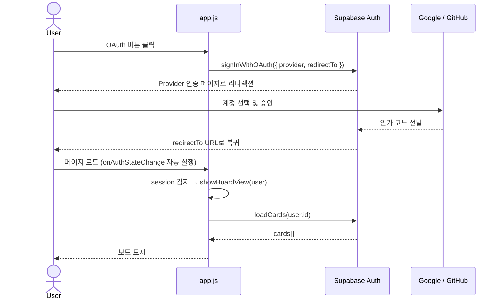
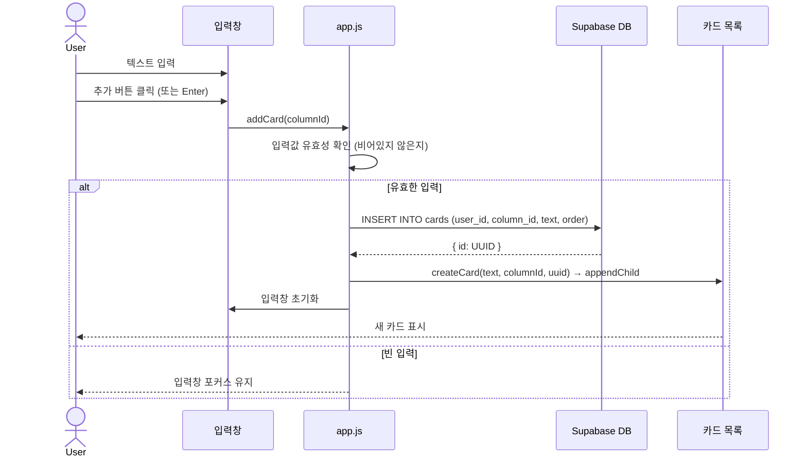
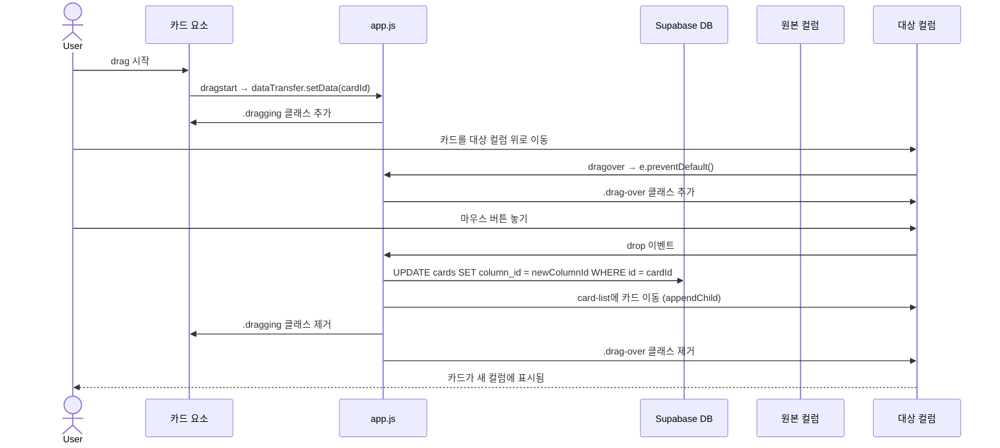
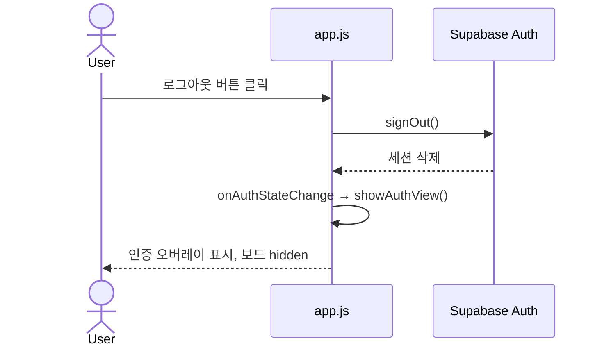

# User Flow — 사용자 흐름도

## 1. 전체 흐름

```mermaid
flowchart TD
    A([브라우저에서 index.html 열기]) --> B[onAuthStateChange 실행]
    B --> C{기존 세션 존재?}

    C -->|있음| D[보드 표시 + loadCards]
    C -->|없음| E[인증 오버레이 표시]

    D --> F{사용자 행동 선택}
    F --> G[카드 추가]
    F --> H[카드 이동\n드래그 앤 드롭]
    F --> I[카드 삭제]
    F --> J[로그아웃]

    E --> K{인증 방법 선택}
    K --> L[이메일/비밀번호]
    K --> M[Google OAuth]
    K --> N[GitHub OAuth]
    K --> O[이메일 회원가입]

    L --> P{로그인 성공?}
    P -->|성공| D
    P -->|실패| Q[에러 메시지 표시] --> E

    M --> R[Google 인증 페이지 리디렉션]
    N --> S[GitHub 인증 페이지 리디렉션]
    R --> D
    S --> D

    O --> T{회원가입 성공?}
    T -->|성공| U[확인 이메일 안내 또는 자동 로그인] --> D
    T -->|실패| Q

    J --> E
```

---

## 2. 인증 흐름 — 이메일/비밀번호

```mermaid
sequenceDiagram
    actor User
    participant Form as 인증 폼
    participant JS as app.js
    participant Supabase as Supabase Auth

    User->>Form: 이메일 + 비밀번호 입력
    User->>Form: 로그인 버튼 클릭
    Form->>JS: handleAuthSubmit()
    JS->>Supabase: signInWithPassword({ email, password })
    alt 성공
        Supabase-->>JS: session 반환
        JS->>JS: onAuthStateChange → showBoardView(user)
        JS->>Supabase: loadCards(user.id)
        Supabase-->>JS: cards[]
        JS-->>User: 보드 표시
    else 실패
        Supabase-->>JS: error
        JS-->>User: showError(error.message)
    end
```

---

## 3. 인증 흐름 — OAuth (Google / GitHub)

```mermaid
sequenceDiagram
    actor User
    participant JS as app.js
    participant Supabase as Supabase Auth
    participant Provider as Google / GitHub

    User->>JS: OAuth 버튼 클릭
    JS->>Supabase: signInWithOAuth({ provider, redirectTo })
    Supabase-->>User: Provider 인증 페이지로 리디렉션
    User->>Provider: 계정 선택 및 승인
    Provider-->>Supabase: 인가 코드 전달
    Supabase-->>User: redirectTo URL로 복귀
    User->>JS: 페이지 로드 (onAuthStateChange 자동 실행)
    JS->>JS: session 감지 → showBoardView(user)
    JS->>Supabase: loadCards(user.id)
    Supabase-->>JS: cards[]
    JS-->>User: 보드 표시
```

---

## 4. 카드 추가 흐름

```mermaid
sequenceDiagram
    actor User
    participant Input as 입력창
    participant JS as app.js
    participant Supabase as Supabase DB
    participant DOM as 카드 목록

    User->>Input: 텍스트 입력
    User->>Input: 추가 버튼 클릭 (또는 Enter)
    Input->>JS: addCard(columnId)
    JS->>JS: 입력값 유효성 확인 (비어있지 않은지)
    alt 유효한 입력
        JS->>Supabase: INSERT INTO cards (user_id, column_id, text, order)
        Supabase-->>JS: { id: UUID }
        JS->>DOM: createCard(text, columnId, uuid) → appendChild
        JS->>Input: 입력창 초기화
        DOM-->>User: 새 카드 표시
    else 빈 입력
        JS-->>User: 입력창 포커스 유지
    end
```

---

## 5. 드래그 앤 드롭 흐름

```mermaid
sequenceDiagram
    actor User
    participant Card as 카드 요소
    participant JS as app.js
    participant Supabase as Supabase DB
    participant ColA as 원본 컬럼
    participant ColB as 대상 컬럼

    User->>Card: drag 시작
    Card->>JS: dragstart → dataTransfer.setData(cardId)
    JS->>Card: .dragging 클래스 추가

    User->>ColB: 카드를 대상 컬럼 위로 이동
    ColB->>JS: dragover → e.preventDefault()
    JS->>ColB: .drag-over 클래스 추가

    User->>ColB: 마우스 버튼 놓기
    ColB->>JS: drop 이벤트
    JS->>Supabase: UPDATE cards SET column_id = newColumnId WHERE id = cardId
    JS->>ColB: card-list에 카드 이동 (appendChild)
    JS->>Card: .dragging 클래스 제거
    JS->>ColB: .drag-over 클래스 제거
    ColB-->>User: 카드가 새 컬럼에 표시됨
```

---

## 6. 로그아웃 흐름

```mermaid
sequenceDiagram
    actor User
    participant JS as app.js
    participant Supabase as Supabase Auth

    User->>JS: 로그아웃 버튼 클릭
    JS->>Supabase: signOut()
    Supabase-->>JS: 세션 삭제
    JS->>JS: onAuthStateChange → showAuthView()
    JS-->>User: 인증 오버레이 표시, 보드 hidden
```
